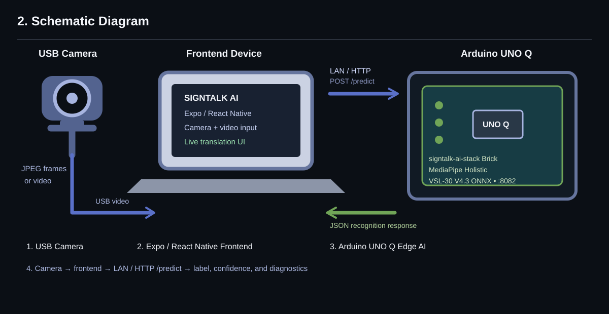
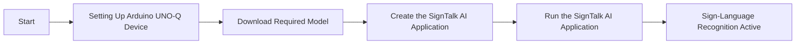
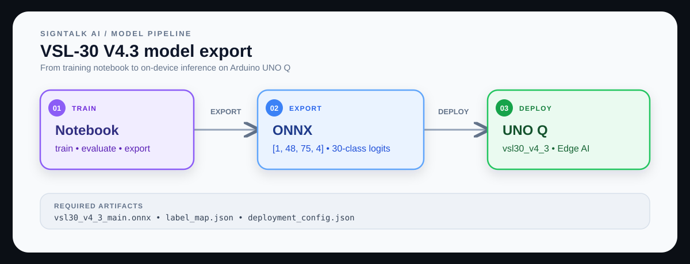
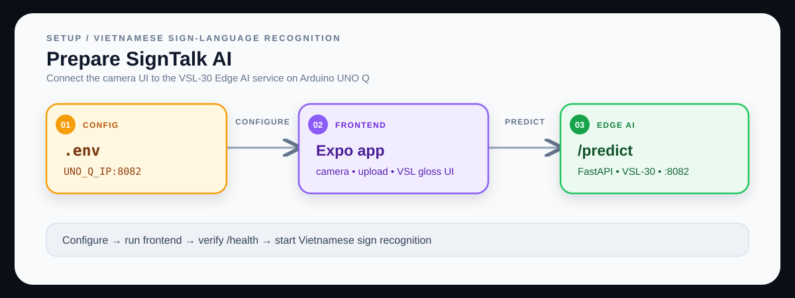
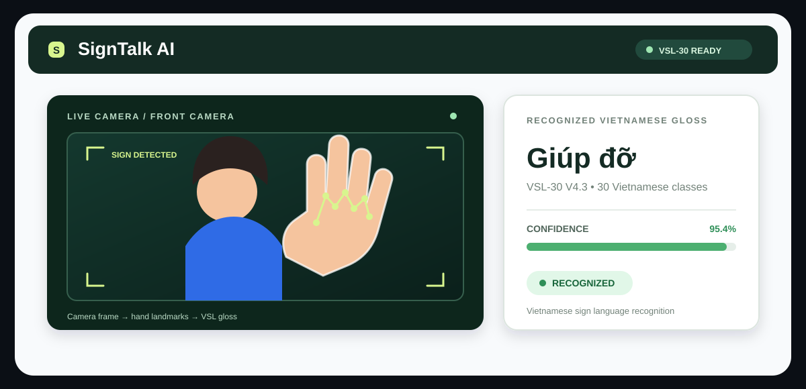
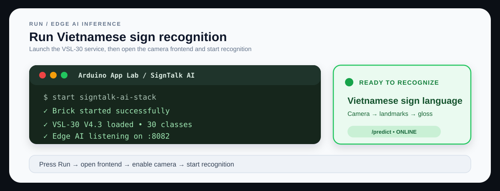
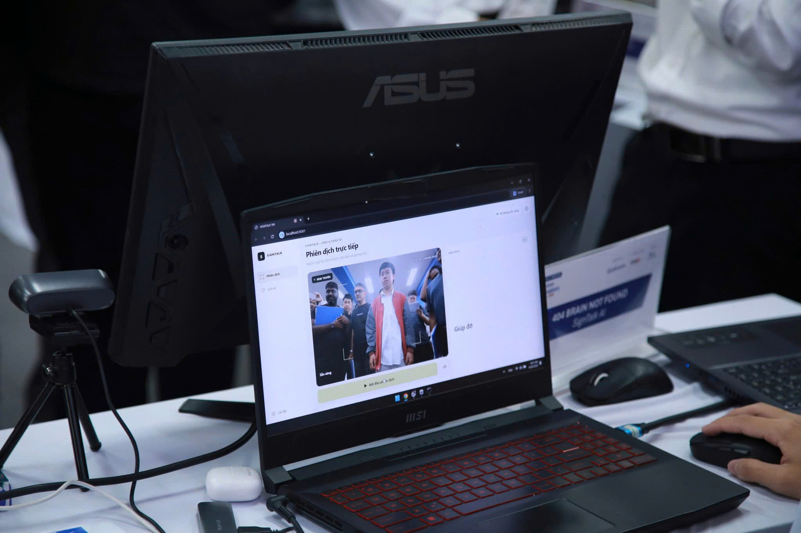
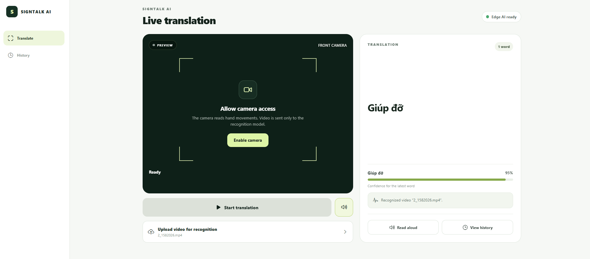

# SignTalk AI on Camera
## Table of Contents
- [1. Overview](#1-overview)
- [2. Schematic Diagram](#2-schematic-diagram)
- [3. Requirements](#3-requirements)
  - [3.1 Hardware](#31-hardware)
  - [3.2 Software](#32-software)
- [4. SignTalk AI Workflow](#4-signtalk-ai-workflow)
- [5. Setup Instructions](#5-setup-instructions)
  - [5.1 Setting Up Visual Studio Code (VS Code)](#51-setting-up-visual-studio-code-vs-code)
  - [5.2 Setting Up Arduino App Lab](#52-setting-up-arduino-app-lab)
  - [5.3 Setting Up Arduino Flasher CLI](#53-setting-up-arduino-flasher-cli)
  - [5.4 Setting Up Arduino UNO-Q Device](#54-setting-up-arduino-uno-q-device)
- [6. Get the Model from the VSL-30 Training Pipeline](#6-get-the-model-from-the-vsl-30-training-pipeline)
  - [6.1 Setup the VSL-30 Model](#61-setup-the-vsl-30-model)
  - [6.2 Use the VSL-30 Training Project](#62-use-the-vsl-30-training-project)
  - [6.3 Build and Download Deployable Model](#63-build-and-download-deployable-model)
- [7. Prepare the Application](#7-prepare-the-application)
  - [7.1 Copy Existing Camera Recognition Application](#71-copy-existing-camera-recognition-application)
  - [7.2 Upload Model to the Device](#72-upload-model-to-the-device)
  - [7.3 Modify the Configuration file](#73-modify-the-configuration-file)
- [8. Run the SignTalk AI application](#8-run-the-signtalk-ai-application)
  - [8.1 Demo Output](#81-demo-output)

## 1. Overview.

The **SignTalk AI** demo showcases the edge AI capabilities of the **Arduino® UNO Q** using a trained VSL-30 V4.3 model. This application enables real-time Vietnamese sign-language recognition from a live camera feed or an uploaded video.
- **Live Sign-Language Recognition**: Continuously captures frames from a camera and recognizes Vietnamese sign-language glosses.
- **AI-Powered Processing**: Utilizes MediaPipe Holistic to analyze video frames and extract pose and hand landmarks.
- **Real-Time Visualization**: Displays the recognized gloss, confidence, and acceptance status in the application interface.
- **Web-Based Interface**: Managed through an interactive Expo/React Native web interface for seamless control and monitoring.
> **Important:** This demo must be run with the Edge AI service available in **Network Mode or SBC** within the Arduino App Lab. It requires the frontend device and Arduino UNO Q to be reachable on the same network, with Edge AI exposed on port `8082`.

This demonstration highlights how the Arduino UNO Q can be paired with a camera-enabled application to perform edge AI tasks such as Vietnamese sign-language recognition. It exemplifies the integration of MediaPipe landmark extraction, an ONNX model, and a custom Arduino App Lab Brick for intelligent, real-time computer vision applications.

The documentation follows the section order and setup progression of Qualcomm's [Gesture Detection on Camera README](https://github.com/qualcomm/Startup-Demos/tree/main/CV_VR/IoT-Robotics/GestureDetection). The model and application steps are adapted to this repository's VSL-30 training/export pipeline and are therefore project-specific rather than Edge Impulse steps.

## 2. Schematic Diagram



1. **Arduino UNO Q** running the `signtalk-ai-stack` Edge AI Brick
2. **USB camera** connected to the frontend device
3. **Personal computer or mobile device** running the Expo/React Native frontend
4. **Local network** connecting the frontend to UNO Q on port `8082`
5. **HDMI display, keyboard, and mouse** when using SBC mode

## 3. Requirements
### 3.1 Hardware

- **[Arduino® UNO Q](https://docs.arduino.cc/hardware/uno-q)**
- USB camera (x1)
- USB-C® hub adapter with external power (x1) when using peripherals in SBC mode
- A power supply (5 V, 3 A) for the USB hub when required
- Personal computer (x86/AMD64) with internet access

### 3.2 Software

- Arduino App Lab.
- Arduino Bricks.
- Visual Studio Code.
- Node.js 24.x, pnpm 10.x, and Python 3.11 or later.
- Expo/React Native, FastAPI, MediaPipe, and ONNX Runtime dependencies installed by the project setup.

## 4. SignTalk AI Workflow



## 5. Setup Instructions

Before proceeding further, please ensure that **all the setup steps outlined below are completed in the specified order**. These instructions are essential for configuring the various tools required to successfully run the application.

Each section provides a reference to project files or official documentation for detailed guidance. Please follow them carefully to avoid any setup issues later in this process.

## 5.1 Setting Up Visual Studio Code (VS Code)

Visual Studio Code is the recommended IDE for editing, debugging, and managing the project’s source code. It provides an integrated terminal and development environment for the Expo frontend, FastAPI Edge AI service, and Arduino App Lab package. Follow this step before configuring the UNO Q application.

For detailed steps, install the project dependencies from the repository root:

```powershell
pnpm install
Copy-Item apps/mobile/.env.example apps/mobile/.env
```

## 5.2 Setting Up Arduino App Lab

Arduino App Lab enables you to create and deploy Apps directly on the Arduino® UNO Q board, which integrates both a microcontroller and a Linux-based microprocessor. App Lab runs on Windows, macOS, and Linux, and the UNO Q also includes App Lab for device-side execution. The SignTalk AI App Lab package includes the custom `signtalk-ai-stack` Brick that runs the VSL-30 V4.3 Edge AI service.

Import the package from:

```text
artifacts/SignTalk-AI-UNO-Q-Recognition-Only-VSL30-V4_3.zip
```

For detailed steps, refer to the official documentation: [Arduino App Lab](https://docs.arduino.cc/software/app-lab/)

## 5.3 Setting Up Arduino Flasher CLI

Arduino Flasher CLI provides a streamlined way to flash Linux images onto your Arduino UNO Q board. Please follow the setup instructions carefully to avoid flashing errors and ensure proper board initialization.

If the UNO Q is already configured and visible in Arduino App Lab, this step can be skipped.

For detailed steps, refer to the official documentation: [Arduino UNO Q](https://docs.arduino.cc/hardware/uno-q)

## 5.4 Setting Up Arduino UNO-Q Device

Arduino UNO-Q must be properly configured to ensure reliable communication with the host system and accurate Edge AI service execution. Configure the device in Network Mode or Single-Board Computer mode, then connect the frontend device and UNO Q to the same local network.

For detailed steps, refer to the official documentation: [Set up Arduino UNO Q](https://docs.arduino.cc/hardware/uno-q)

After the App Lab package is running, verify the Edge AI service:

```powershell
curl.exe http://UNO_Q_IP:8082/health
```

The response must contain `"status":"ok"` and `"model_id":"vsl30_v4_3"`.

## 6. Get the Model from the VSL-30 Training Pipeline

The VSL-30 training pipeline empowers you to prepare datasets, train the classifier, evaluate the result, and export a deployable ONNX model for direct integration with the Arduino UNO Q Edge AI service.

### 6.1 Setup the VSL-30 Model

The active model is registered as `vsl30_v4_3` and is stored in the repository at `services/edge-ai/models/vsl30_v4_3/`.

The model requires the following deployment contract:

```text
Input:  keypoints, float32 [batch, 48, 75, 4]
Output: logits for 30 Vietnamese sign-language glosses
Runtime: ONNX Runtime CPUExecutionProvider
```

For detailed steps, refer to the model metadata and export files in `services/edge-ai/models/vsl30_v4_3/`.

### 6.2 Use the VSL-30 Training Project

The VSL-30 training project is included as a Jupyter notebook. It contains the training, evaluation, and export workflow used by the production Edge AI service.

Use the [VSL-30 V4.3 training notebook](notebooks/vsl30_v4_3_train_evaluate_export.ipynb).

The production notebook includes implementation notes for the 75-point landmark contract, shoulder-based normalization, fixed 48-step resampling, staged training, and deployment export. These details must stay aligned with the Edge AI predictor.

The low-shot notebooks are research alternatives and do not produce the classifier input/output contract required by the current service.

For detailed steps, use the training notebook included in the repository.

### 6.3 Build and Download Deployable Model

The training pipeline allows you to build an optimized model tailored for deployment on the Arduino UNO Q. Once trained, the model can be exported and copied into the Edge AI service for direct integration with the application.

**Mandatory step:**
1. Export the VSL-30 V4.3 ONNX model with input name `keypoints` and shape `[1, 48, 75, 4]`.
2. Export a `label_map.json` containing labels indexed from `0` to `29`.
3. Copy the deployable artifacts to `services/edge-ai/models/vsl30_v4_3/`.



For detailed steps, refer to the VSL-30 training notebook and the model files in the repository.

## 7. Prepare the Application

This section will guide you on how to create the application from the existing camera recognition frontend, configure the VSL-30 model and Edge AI service, set up the application parameters, and build the final App for deployment on the Arduino UNO Q. Starting from the included application is recommended for first-time users to better understand the structure and workflow.

### 7.1 Copy Existing Camera Recognition Application

The repository provides a ready-to-use Expo camera recognition application in `apps/mobile`. This application can be configured and customized for the SignTalk AI use case, including live camera capture, video upload, recognition results, and session history.

In this example we are using the existing camera recognition application for Vietnamese sign-language recognition.





For detailed steps, refer to the application source in `apps/mobile`.

### 7.2 Upload Model to the Device

Once the deployable model is built, it must be uploaded to the Arduino UNO Q to enable real-time inference and application integration. Here we will use the model included in the SignTalk AI App Lab package.

Upload the package from [SignTalk AI App Lab package](artifacts/SignTalk-AI-UNO-Q-Recognition-Only-VSL30-V4_3.zip) and run it in Arduino App Lab.

The Edge AI service is started with:

```text
python -m src.main --serve --port 8082
```

For manual deployment, upload the model directory to `services/edge-ai/models/vsl30_v4_3/` in the Brick or container build context.

For detailed steps, refer to the model and package files in the repository.

### 7.3 Modify the Configuration file

The `app.yaml` file defines the structure, behavior, and dependencies of your Arduino App Lab application. Modifying this configuration allows you to customize how your app integrates the Edge AI Brick and launches on the Arduino UNO Q.

```yaml
name: SignTalk AI Edge AI
description: VSL sign-language recognition Edge AI on Arduino UNO Q.

bricks:
  - signtalk-ai-stack
```

The frontend endpoint is configured in `apps/mobile/.env`:

```env
EXPO_PUBLIC_EDGE_AI_URLS=http://UNO_Q_IP:8082
```

## 8. Run the SignTalk AI application

Once your SignTalk AI application is configured and built in Arduino App Lab, it can be deployed and executed directly on the Arduino UNO Q. This section will guide you through launching the application, verifying camera input, and observing real-time Vietnamese sign-language recognition.



For detailed steps, refer to the [Arduino App Lab quickstart](https://docs.arduino.cc/software/app-lab/getting-started/quickstart/), then import the App Lab ZIP, select the UNO Q target, and click **Run**.

For local development without an UNO Q, run the Edge AI service first:

```powershell
cd services/edge-ai
Copy-Item .env.example .env
python -m venv .venv
.\.venv\Scripts\Activate.ps1
python -m pip install -e ".[dev]"
python -m src.main --serve --port 8082
```

Then start the frontend from the repository root:

```powershell
pnpm dev:web
```

### 8.1 Demo Output

When the application is running, enable the camera, start translation, and perform one of the 30 trained glosses in the camera frame.





The application displays the recognized gloss, translated text, confidence, landmark coverage, acceptance status, and session history. You can also select **Upload a video** to test an MP4, MOV, or WebM file.
